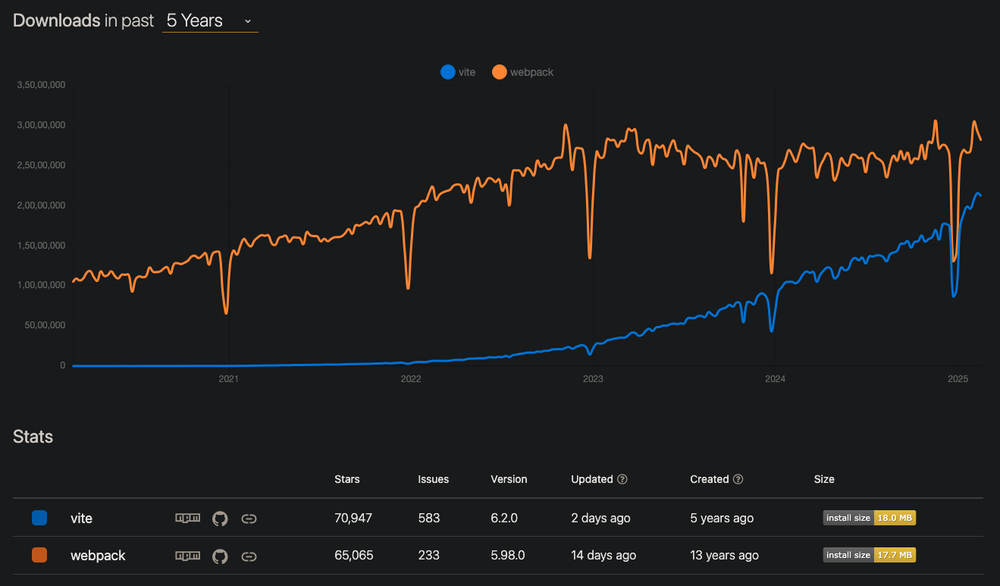
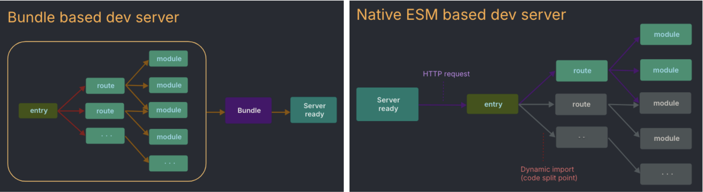

# Sunrise after CRA Sunset: Create React App to Vite Migration

## 📝 Introduction

If you've worked with React, you've likely encountered Create React App (CRA)—a command-line tool designed to simplify the process of bootstrapping new React projects. CRA provided a zero-config setup by bundling essential tools like Webpack, Babel, and ESLint, allowing developers to start coding immediately without dealing with complex configurations.

However, as modern development practices evolve, CRA’s capabilities have become increasingly limited. According to the official React documentation:

> "Although Create React App makes it easy to get started, there are several limitations that make it difficult to build high-performance production apps. In principle, we could solve these problems by essentially evolving it into a framework."

## 🚀 Why Migrate from CRA?

Our team relied on CRA for a long time, but as our application scaled, we started encountering several issues that significantly impacted our development speed and efficiency.

### Some challenges faced using CRA:

### 🐌 Slow Build Times

CRA relies on Webpack, which pre-processes and bundles all dependencies upfront. As the project grew, this led to increasingly long build times, slowing down iteration speed.

### ⏳ Long Startup Times

The development server took several seconds to boot up, causing frustration and delays when making quick changes.

### 🏗️ Bloated Configurations

While CRA abstracted Webpack configurations, it also bundled unnecessary dependencies that we rarely touched but still had to maintain.

### 🔄 Slow Hot Module Replacement (HMR)

HMR in CRA was inefficient, causing delays in previewing changes. In contrast, modern tools provide instant feedback, making the development experience much smoother.

### ⚠️ CRA’s Deprecation

With CRA officially deprecated in February 2025 and its last update in 2022, maintaining compatibility with modern React libraries became increasingly difficult. Sticking with CRA would have meant more workarounds and technical debt in the long run.

> Considering these issues, we had to decide: Should we migrate to a framework or switch to a different build tool?

## 🔍 Framework or Build Tool?

Most apps would benefit from a framework, but there are valid cases to build a React app from scratch. A good rule of thumb is if your app needs routing, you would probably benefit from a framework.

Since our app was already well-structured with React, adding a full-fledged framework would have introduced unnecessary complexity. Instead, we focused on improving developer experience and build performance, leading us to **Vite**—a faster and more efficient alternative to Webpack-based setups like CRA.

## ⚡ What is Vite?

Vite (French word for "quick", pronounced _/vit/_, like "veet") is a build tool that aims to provide a faster and leaner development experience for modern web projects. It consists of two major parts:

1. **A dev server** that provides rich feature enhancements over native ES modules, for example, extremely fast Hot Module Replacement (HMR).
2. **A build command** that bundles your code with Rollup, pre-configured to output highly optimized static assets for production.

## 🎯 How Vite is Different

Unlike Webpack, which bundles everything upfront, Vite leverages native ES modules (ESM) and only processes the files needed on demand. This results in:

- ⚡ **Instant Startup** – No waiting for the entire app to compile. Vite serves files directly to the browser, enabling instant cold starts.
- 🔥 **Faster HMR** – Changes reflect instantly in the browser without a full-page reload, making development smoother.
- 📦 **Smaller & Optimized Builds** – Vite uses esbuild for pre-bundling, which is 10-100x faster than Webpack.
- 🛠️ **Simplified Configuration** – Unlike CRA, which requires ejecting for custom setups, Vite offers a simple `vite.config.js` file for flexibility.
- 📉 **Less Boilerplate & Dependencies** – CRA comes with outdated dependencies. Vite is leaner, faster, and more efficient.
  

## ⚠️ Caveats

While Vite offers significant advantages, there are some caveats to consider:

### ❌ Vite Doesn’t Use ESM for Production

Although native ESM is widely supported, using unbundled ESM in production remains inefficient due to extra network round trips—even with HTTP/2. For optimal performance, bundling with tree-shaking, lazy-loading, and chunk splitting is still necessary.

### 🔄 Vite Uses Rollup Instead of esbuild for Production

Vite's current plugin API isn't compatible with esbuild as a production bundler. While esbuild is faster, Rollup provides a better balance between performance and flexibility. However, ongoing efforts, such as the Rust-based **Rolldown** project, may further improve Vite’s build performance in the future.

## 🎉 Conclusion

Migrating from CRA to Vite drastically improved our development workflow, reducing build times, enhancing responsiveness, and simplifying configuration.

✅ **Build time dropped from 5 minutes to just 60 seconds.**
✅ **Development server startup reduced from 30 seconds to under 1 second.**
✅ **Hot reloading is now nearly instantaneous, thanks to Vite’s optimized approach.**

This transition has empowered our team to iterate faster, reduce friction in development, and maintain a scalable build system.

## 📚 References

- 📄 [Vite Official Guide](https://vitejs.dev/)
- 📢 [React Blog: Sunsetting Create React App](https://react.dev/blog/2025/sunsetting-create-react-app)

### 🔜 Next Steps: [Read the Migration Guide →](https://vitejs.dev/guide/)
